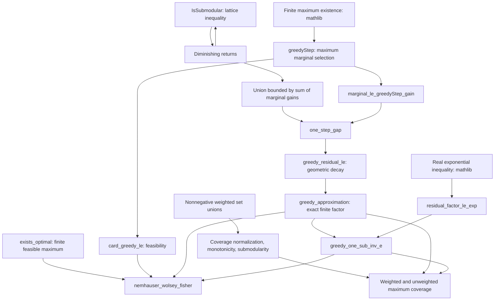

# NWF proof dependency map

The arrows below are mathematical dependencies between declarations in this
release. Mathlib supplies the finite-set, finite-sum, order, and exponential
infrastructure beneath these steps.

## Where the assumptions enter

- **Submodularity** gives diminishing returns and controls the sum of marginal gains.
- **Monotonicity** compares a feasible set with its union with the greedy set and ensures nonnegative gains.
- **Normalization** initializes the residual at `f(T)` and ensures comparator values are nonnegative.
- **Positive budget** permits division by `k`; zero budget is handled separately.
- **Finite ground set** provides a marginal maximizer and an optimal feasible comparator.
- **Nonnegative coverage weights** give monotonicity and the coverage intersection inequality.

`one_step_gap` proves the recurrence from these assumptions and the greedy
construction. The final theorem does not take the recurrence or an approximation
guarantee as an assumption. Its comparator may be any feasible set; existence of
an optimum is bundled into `nemhauser_wolsey_fisher`.

## Trust boundary

`greedyStep` chooses one maximum by `Classical.choose`. Tie-breaking is unspecified
but fixed by that definition. No particular favorable tie is assumed. The code
does not provide executable real-number comparisons, an oracle-cost theorem,
or a verified runtime implementation. Once every element is selected, the next
step returns the same set.

All public definitions and theorem statements are included in `Audit.lean`.
`scripts/check_axioms.py` checks recursive source coverage and rejects axioms
outside `propext`, `Classical.choice`, and `Quot.sound`.
